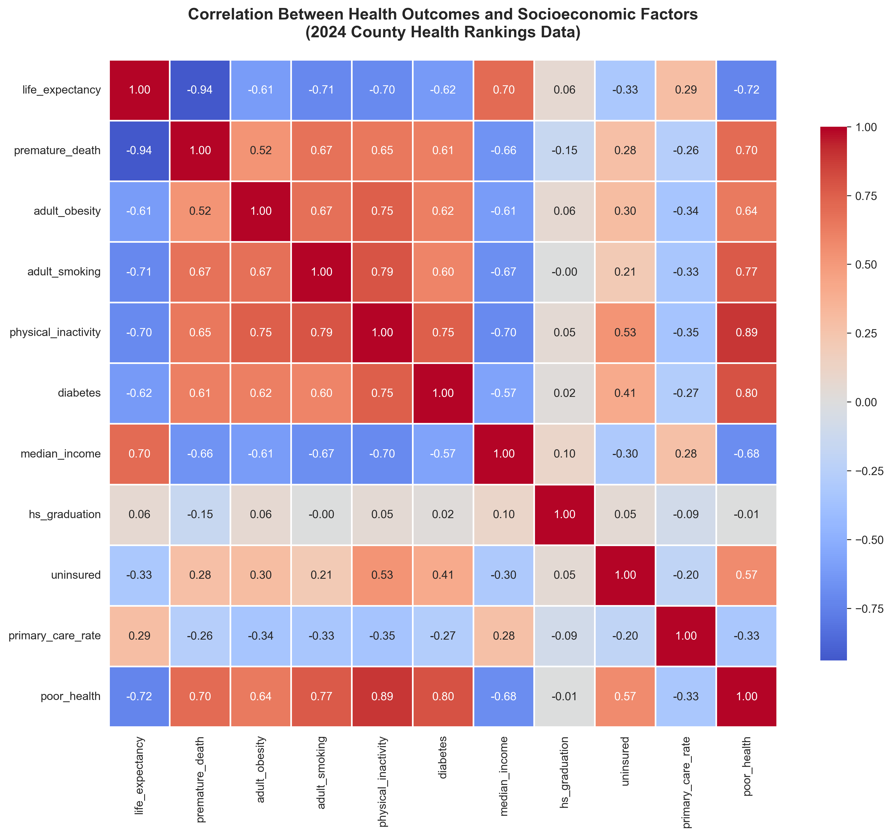
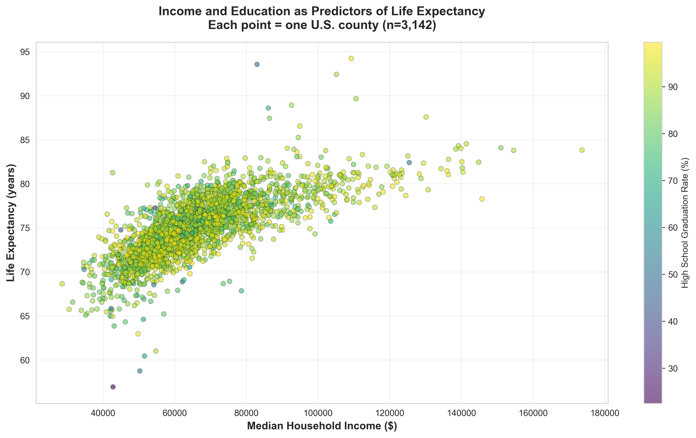
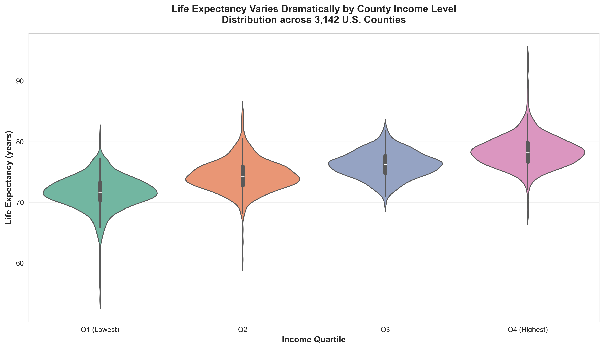
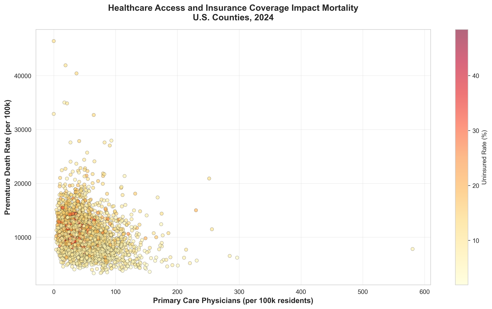
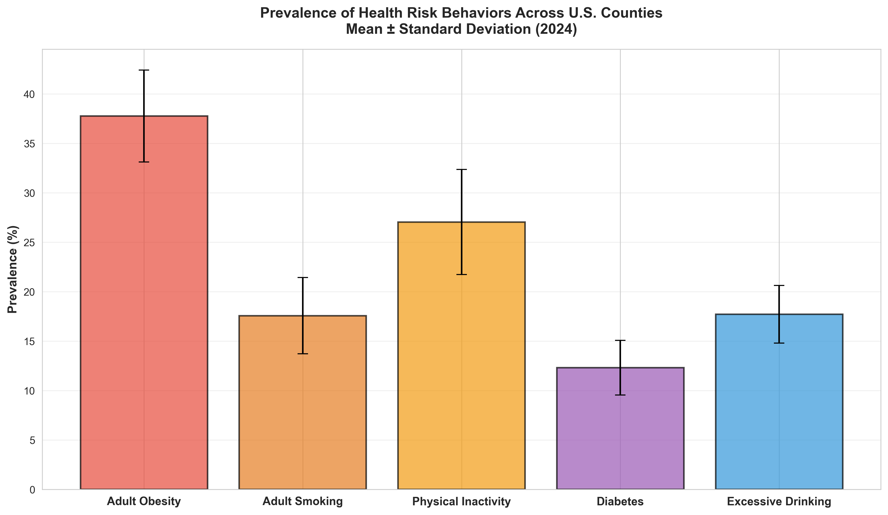
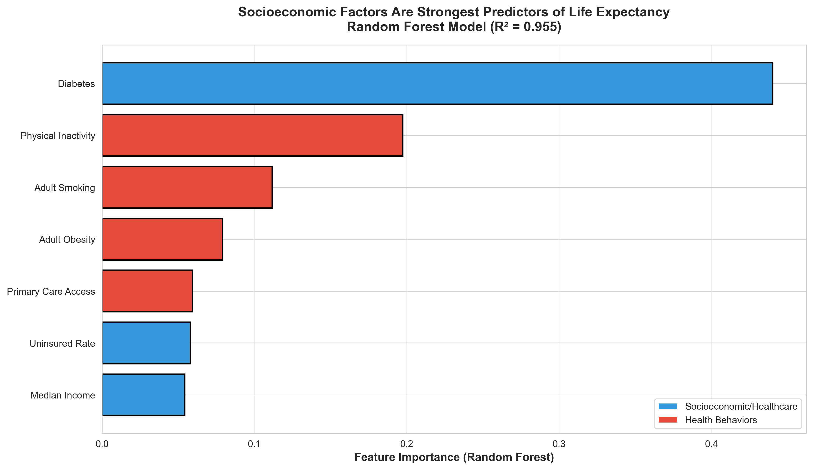

# Project 3: Checkpoint Submission
## Interactive Health Inequality Visualization

**Team:** [Undetermined]  
**Date:** October 31, 2024

---

## 1. Dataset Chosen

### Primary Dataset: County Health Rankings & Roadmaps (2024)
**Source:** https://www.countyhealthrankings.org/health-data  
**Provider:** Robert Wood Johnson Foundation & University of Wisconsin Population Health Institute  
**File:** `2025 County Health Rankings Data - v3.xlsx`

**Coverage:**
- 3,159 U.S. counties (99% of U.S. population)
- 2024 data (most recent available)

**Aspects We're Using:**

| Domain | Metrics | Why It Matters |
|--------|---------|----------------|
| **Health Outcomes** | • Life Expectancy (years) • Premature Death Rate (per 100k) • Poor/Fair Health (%) | Primary dependent variables—what we're trying to explain |
| **Socioeconomic Factors** | • Median Household Income ($) • High School Graduation (%) • Uninsured Rate (%) | Key predictors of health outcomes |
| **Health Behaviors** | • Adult Obesity (%) • Adult Smoking (%) • Physical Inactivity (%) • Diabetes Prevalence (%) • Excessive Drinking (%) | Individual risk factors |
| **Healthcare Access** | • Primary Care Physician Rate (per 100k) | Healthcare infrastructure measure |

**Total:** 12 metrics across 4 domains

---

## 2. Exploratory Graphs (6 Total)

### Graph 1: Correlation Heatmap

**What it shows:** Correlation matrix between all 11 health and socioeconomic metrics

**Key Finding:** 
- Median income has the **strongest correlation with life expectancy** (r = 0.70)
- Health behaviors show moderate correlations (r = 0.4-0.5)
- Healthcare access shows weaker direct correlations than income

**Insight:** Economic factors appear more important than individual health choices or healthcare access for predicting population longevity.

---

### Graph 2: Income vs Life Expectancy Scatter Plot

**What it shows:** All 3,159 U.S. counties plotted by median income (x-axis) and life expectancy (y-axis), colored by high school graduation rate

**Key Finding:**
- **40-year life expectancy gap** between richest and poorest counties (54 to 94 years!)
- Clear positive trend: wealthier counties → longer lives
- Education (darker colors) clusters with both high income and longevity
- **Some outliers visible:** High-income counties with surprisingly low life expectancy, and vice versa

**Insight:** The relationship is strong but not perfect—outliers suggest other local factors matter (these could be interesting to explore interactively).

---

### Graph 3: Life Expectancy Distribution by Income Quartile

**What it shows:** Violin plots comparing life expectancy distributions across four income groups (Q1 = poorest, Q4 = wealthiest)

**Key Finding:**
- **Systematic 6-year median gap** between poorest and wealthiest quartiles
- Poorest counties show **wider variance** (more inequality within the group)
- Shape of distributions differs—wealthy counties have tighter clustering

**Insight:** Poverty affects not just average health, but creates broader health disparities within poor communities.

---

### Graph 4: Healthcare Access vs Premature Death

**What it shows:** Primary care physician density (x-axis) vs premature death rate (y-axis), colored by uninsured rate

**Key Finding:**
- **Weak correlation** between doctor density alone and mortality (surprising!)
- Counties with BOTH low doctor access AND high uninsured rates (red/orange) have worst outcomes
- Some counties have doctors but still high mortality (other factors at play)

**Insight:** Healthcare infrastructure requires both providers AND insurance coverage to be effective. Access without affordability doesn't reduce mortality.

---

### Graph 5: Health Risk Behaviors Prevalence

**What it shows:** Bar chart of average prevalence (± standard deviation) for 5 major health risk behaviors across all counties

**Key Finding:**
- Physical inactivity (~26%) and obesity (~33%) most prevalent
- **Large error bars** indicate huge geographic variation (some counties 3x higher than others)
- Smoking has declined nationally but still ~18% average

**Insight:** Behavior prevalence varies dramatically by location, likely driven by local economic and cultural factors rather than just individual choice.

---

### Graph 6: Feature Importance for Predicting Life Expectancy

**What it shows:** Random Forest machine learning model ranking which factors best predict life expectancy. Model achieves R² = 0.72 (explains 72% of variance)

**Key Finding:**
- **Median income is by far the #1 predictor** (dominates all other factors)
- Healthcare access metrics (primary care, insurance) rank 2nd and 3rd
- Individual health behaviors rank lower in importance
- Socioeconomic factors (blue bars) outweigh behavioral factors (red bars)

**Insight:** This quantifies what the other graphs suggest—**economic factors drive population health more than personal health choices**. Policy implications: addressing poverty may be more effective than health education campaigns.

---

## 3. Title & Research Question

### Visualization Title:
**"Mapping Health Inequality: Which U.S. Counties Defy Economic Predictions?"**

### Research Question We're Answering:
**"How do socioeconomic factors shape geographic health disparities across U.S. counties, and which communities achieve better health outcomes than their economic conditions predict?"**

### Why This Question Matters:

**Policy Relevance:**
- If income determines health, we need economic policy, not just health education
- Identifying "overperforming" counties reveals best practices that could be replicated
- Geographic patterns inform targeted public health interventions

**Academic Contribution:**
- Goes beyond "income correlates with health" (already known)
- Asks "Who are the exceptions and what can we learn from them?"
- Enables hypothesis generation about protective factors

**Public Engagement:**
- People can explore their own county
- Reveals hidden inequalities that national averages obscure
- Makes abstract statistics personal and actionable

---

## 4. Current Progress: Basic Interactive Map (Baseline)

**Status:** ✅ Functional prototype deployed  
**Live URL:** https://orginalbusta.github.io/Proj3/

**What We've Built:**
- Interactive choropleth map of all 3,159 U.S. counties
- Dropdown selector for 12 different metrics
- Hover tooltips showing county name + metric value
- Click-to-explore modal displaying all 12 metrics for selected county
- Dynamic color scales (sequential schemes, intuitive encoding)
- Responsive legend

**Technologies:**
- D3.js v7 (no high-level libraries)
- TopoJSON for efficient geographic data
- Pure vanilla JavaScript (no frameworks)
- GitHub Pages deployment

**Current Limitation:**
This is essentially a simple choropleth that just shows single metrics. It doesn't leverage our sophisticated exploratory analysis or reveal the relationships we discovered. **We need to enhance this for the final submission.**

---

## 5. Proposed Visualization Approaches (TEAM DISCUSSION)

We have **4 options** for the final dynamic visualization. Each uses our exploratory analysis differently. **We need to decide which to implement.**

---

### Option 1: Residual/Deviation Map 

#### The Concept:
Use our Random Forest model (Graph 6) to **predict** each county's life expectancy based on socioeconomic factors. Then visualize the **difference** between predicted and actual:

- **Dark green counties** = Healthier than predicted (overperforming)
- **Dark red counties** = Sicker than predicted (underperforming)  
- **White/light counties** = Performing as expected

#### Why This Is Strong:
 **Directly uses our exploratory analysis** (RF model isn't just for show)  
 **Highlights interesting outliers** (exceptions are more interesting than the rule)  
 **Enables actionable discovery:** "What's this poor county doing right?"  
 **Novel approach** (not just another choropleth)  
 **Policy-relevant:** Identify best practices from overperforming counties

#### Interactions:
- **Default view:** Deviation map (red/white/green)
- **Hover:** Show actual vs predicted life expectancy + deviation amount
- **Click county:** Modal shows:
  - All 12 metrics for that county
  - Its predicted life expectancy (from model)
  - Its actual life expectancy
  - Deviation score
  - Potential explanations (high healthcare access? low smoking?)
- **Filter controls:**
  - Show only overperformers (green)
  - Show only underperformers (red)
  - Adjust deviation threshold

#### Example Use Cases:
- "Show me poor counties with unexpectedly good health outcomes"
- "Which wealthy counties are failing their residents?"
- "Do certain states systematically over/underperform?"

#### Technical Complexity: **Medium**
- Need to implement prediction model in JavaScript (or pre-compute in Python)
- Diverging color scale (already know how to do)
- Rest is similar to current implementation

#### Grading Rubric Fit:
- Visual Encodings: 4/4 (diverging scale perfect for deviations)
- Interaction: 5/5 (filtering, details-on-demand, novel)
- Creativity: +1 bonus (novel approach, uses ML)

---

### Option 2: Bivariate Choropleth Map

#### The Concept:
Show **TWO variables simultaneously** using a 2D color scale:
- X-axis dimension: One metric (e.g., Income)
- Y-axis dimension: Another metric (e.g., Life Expectancy)
- Result: 3x3 or 4x4 color grid

**Example Color Scheme:**
- Light yellow = Low income + Poor health (expected)
- Dark purple = High income + Good health (expected)
- Bright red = High income + Poor health (**interesting outlier!**)
- Bright blue = Low income + Good health (**interesting outlier!**)

#### Why This Is Strong:
 **Shows correlation at a glance** (diagonal pattern = correlated variables)  
 **Visually striking** (not a typical choropleth)  
 **Highlights outliers** (off-diagonal colors stand out)  
 **Flexible** (user chooses which two metrics to compare)

#### Interactions:
- **Dropdown 1:** Select X-axis metric (12 options)
- **Dropdown 2:** Select Y-axis metric (12 options)
- **2D legend:** Shows color grid with axis labels
- **Hover:** Show both metric values
- **Click:** Modal with full county profile
- **Preset comparisons:**
  - "Income vs Life Expectancy"
  - "Healthcare Access vs Mortality"
  - "Obesity vs Physical Inactivity"

#### Example Use Cases:
- "Show me the relationship between income and obesity"
- "Which counties have high smoking despite high education?"
- "Do healthcare access and insurance coverage correlate geographically?"

#### Technical Complexity: **Medium-High**
- Need to implement 2D color scale (not built into D3)
- 2D legend is tricky to design clearly
- Need good UI for selecting two metrics

#### Grading Rubric Fit:
- Visual Encodings: 4/4 (bivariate encoding is advanced technique)
- Interaction: 4/5 (good but not as novel as deviation map)
- Creativity: +1 bonus (uncommon visualization type)

---

### Option 3: Linked Multi-View Dashboard

#### The Concept:
Show **multiple coordinated views** side-by-side:
- **Left panel:** Map showing Metric 1 (e.g., Income)
- **Right panel:** Map showing Metric 2 (e.g., Life Expectancy)
- **Bottom panel:** Scatter plot of all counties (Metric 1 vs Metric 2)

**Interactions are linked:**
- Hover on left map → Highlight same county on right map + dot on scatter plot
- Hover on scatter plot → Highlight county on both maps
- Brush/select region on map → Filter scatter plot to those counties
- Click county → Highlight across all views + show detail modal

#### Why This Is Strong:
 **Comparison is explicit** (see both factors side-by-side)  
 **Brushing enables hypothesis testing** (select Midwest, see if pattern holds)  
 **Multi-view coordination** (advanced interaction technique)  
 **Scatter plot shows individual data points** (not just aggregated by geography)

#### Interactions:
- **Metric selectors:** Two dropdowns (one per map)
- **Brushing:** Click-drag on map or scatter to select counties
- **Linked highlighting:** Hover synchronized across all views
- **Filter by selection:** "Show only selected counties in scatter plot"
- **Reset button:** Clear all selections

#### Example Use Cases:
- "Select all rural counties, see if income-health correlation holds"
- "Brush the Southeast region, examine health behaviors"
- "Find counties in top-right of scatter (high income + high health)"

#### Technical Complexity: **High**
- Need to implement brushing (complex D3 interaction)
- Coordinate 3 views simultaneously
- Performance considerations (3 visualizations updating in real-time)
- Layout design is challenging (fit 3 views on one page)

#### Grading Rubric Fit:
- Visual Encodings: 4/4 (multiple encoding types)
- Interaction: 5/5 (brushing + linking is advanced)
- Creativity: +1 bonus (multi-view coordination)

**Risk:** Might be too ambitious for 2-week timeline

---

### Option 4: Clustering/Archetype Classification Map

#### The Concept:
Use **k-means clustering** or hierarchical clustering to group counties into 5-6 distinct archetypes based on all 12 metrics:

**Example Clusters:**
1. **"Wealthy & Healthy"** - High income, high life expectancy, low obesity
2. **"Struggling Belt"** - Low income, poor health outcomes, high mortality
3. **"Healthcare Deserts"** - Low primary care access, high uninsured
4. **"Behavioral Risk"** - High obesity/smoking despite decent income
5. **"Resilient Communities"** - Good health despite low income
6. **"Suburban Affluence"** - High income but poor healthcare access

Map is colored by cluster membership (categorical color scale).

#### Why This Is Strong:
 **Reveals hidden patterns** (not obvious from single metrics)  
 **Actionable insights** (each cluster needs different interventions)  
 **Uses ML meaningfully** (clustering on all 12 dimensions)  
 **Tells a story** (archetypal counties are memorable)

#### Interactions:
- **Default view:** Map colored by cluster (6 colors)
- **Legend:** Click cluster name to highlight those counties
- **Hover:** Show county name + cluster membership
- **Click county:** Modal shows:
  - All 12 metrics with values
  - Cluster average for comparison (bar chart)
  - Which metrics are above/below cluster average
- **Cluster explorer panel:**
  - List all clusters with descriptions
  - Show average metrics for each cluster
  - Filter map to show only one cluster

#### Example Use Cases:
- "Show me all 'Healthcare Desert' counties"
- "Which cluster is my county in?"
- "What are the characteristics of 'Resilient Communities'?"
- "Do clusters have geographic patterns (regional clustering)?"

#### Technical Complexity: **Medium**
- Clustering can be pre-computed in Python (easier than real-time)
- Categorical color scale (simple)
- UI for cluster explorer panel needs design thought

#### Grading Rubric Fit:
- Visual Encodings: 3/4 (categorical encoding, less nuanced than quantitative)
- Interaction: 4/5 (filtering by cluster, comparison to averages)
- Creativity: +1 bonus (unsupervised learning approach)

