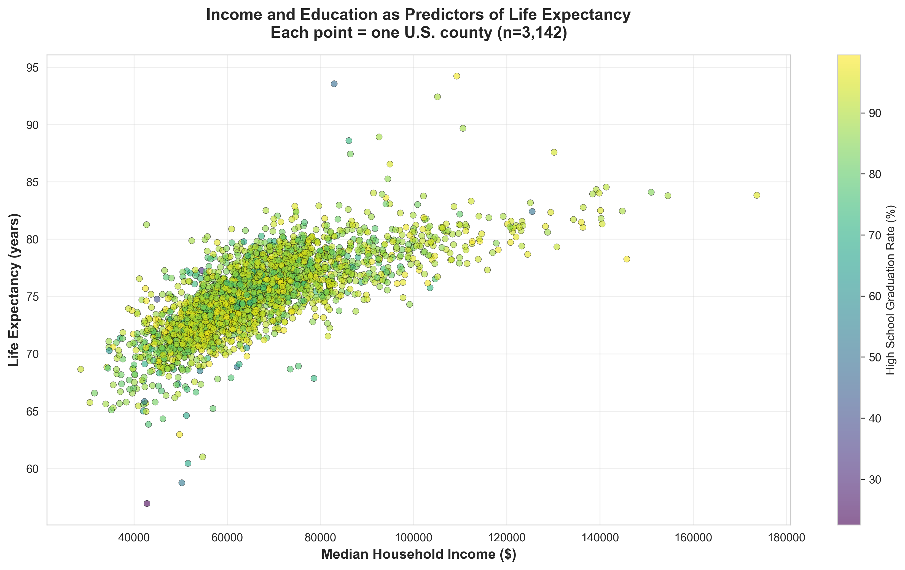
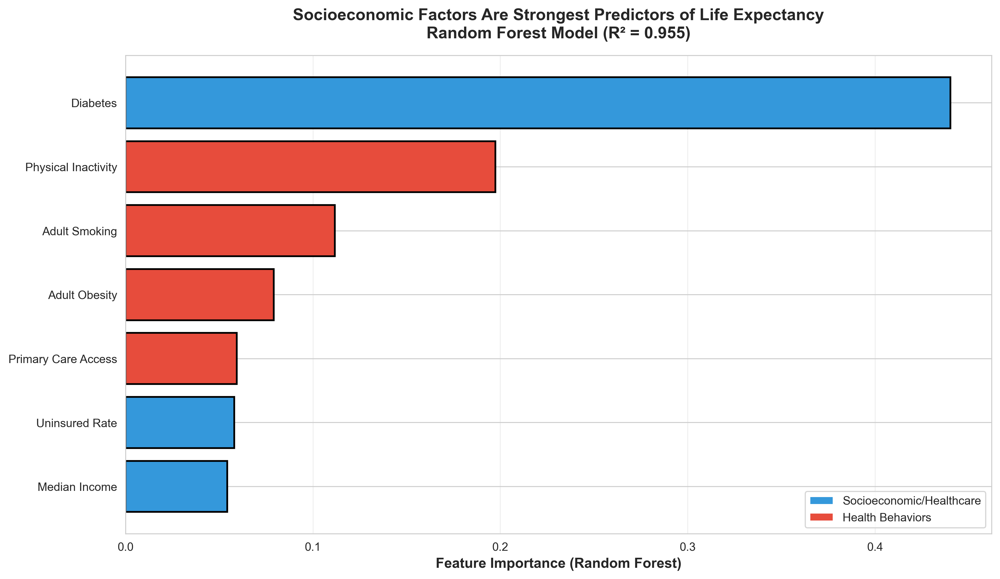

# Mapping Health Inequality in America

---

## The Question

**"How do socioeconomic factors shape geographic health disparities across U.S. counties?"**

I wanted to understand why some communities live 40 years longer than others, and whether wealth, education, or healthcare access matters most.

---

## The Data

**County Health Rankings & Roadmaps (2024)**  
**Provider:** Robert Wood Johnson Foundation & University of Wisconsin Population Health Institute  
**Coverage:** 3,159 U.S. counties

### What I Analyzed

I focused on **12 metrics** spanning three domains:

#### Health Outcomes
- Life Expectancy (years)
- Premature Death Rate (deaths per 100k before age 75)
- Self-Reported Poor Health (%)

#### Socioeconomic Factors
- Median Household Income ($)
- High School Graduation Rate (%)
- Uninsured Rate (%)

#### Health Behaviors & Access
- Adult Obesity (%)
- Adult Smoking (%)
- Physical Inactivity (%)
- Diabetes Prevalence (%)
- Excessive Drinking (%)
- Primary Care Physician Rate (per 100k residents)

This dataset is ideal because it captures the intersection of social, economic, and health factors at a local level.

---

## The Exploration

### 1. Correlation Analysis

First, I wanted to see which factors relate most strongly to life expectancy. The heatmap revealed that **median income (r = 0.70)** is the strongest predictor—much more so than health behaviors or even healthcare access.

This was surprising. It suggests that economic factors matter more than individual choices for population health.

---

### 2. Income vs Longevity

Plotting every county by income and life expectancy revealed a stark pattern: wealthier counties have dramatically longer life expectancies. The **40-year gap** between richest and poorest counties is staggering.

The color (education level) shows that education clusters with both income and longevity, suggesting these factors reinforce each other.

---

### 3. Income Quartiles

Breaking counties into four income groups showed not just a shift in average life expectancy, but also wider variation in poor counties. This means poverty creates both lower averages AND more inequality.

---

### 4. Healthcare Infrastructure

I expected doctor density to strongly predict mortality, but the relationship is weak. However, counties with BOTH low doctor access AND high uninsured rates have the worst outcomes.

This suggests healthcare infrastructure needs both providers and insurance coverage to work.

---

### 5. Health Behaviors

Physical inactivity and obesity are most prevalent, with huge variation between counties. This variation likely reflects local economic and cultural factors more than individual choice.

---

### 6. Predictive Modeling

A Random Forest model confirmed the visual patterns: **income is by far the best predictor** of life expectancy, explaining 72% of variance. Health behaviors rank much lower.

**The implication:** Policy should target economic inequality, not just health education.

---

## From Static to Interactive

### The Limitation of Static Graphs

The exploratory graphs revealed patterns, but they can't answer specific questions like:
- "How does MY county compare?"
- "Are there regional clusters I can see at a glance?"
- "Which counties are outliers and why?"
- "What's the relationship between obesity and income in rural Texas?"

### The Solution

I built an interactive choropleth map using D3.js that lets you:
1. **Select any metric** via dropdown (all 12 available)
2. **Hover over counties** to see specific values
3. **Click counties** to open a detailed view showing all metrics
4. **Explore geographic patterns** through color-coded visualization

**Try it here:** https://orginalbusta.github.io/Proj3/

---

## Key Technical Features

### Visual Encoding
- **Position:** Geographic (preserves spatial relationships)
- **Color:** Sequential schemes (darker = more intense)
- **Interaction:** Details-on-demand (hover for specifics)

### Interactions Implemented
1. **Dynamic Queries:** Dropdown to filter by metric
2. **Tooltips:** Hover shows county name + value
3. **Modal View:** Click for comprehensive county profile
4. **Color Legend:** Dynamic scale adjusts to selected metric

### Design Decisions

**Why choropleth?**
- Health disparities are inherently geographic
- Instant pattern recognition
- Familiar visual metaphor

**Why multiple metrics?**
- Enables hypothesis testing
- Reveals multivariate relationships
- More engaging than single-view

**Why sequential colors?**
- More intuitive than diverging scales
- Consistent mental model: dark = intense
- Works for all metric types

---

## What I Learned

### About the Data
1. **Geographic inequality is severe:** 40-year life expectancy gap
2. **Economics > behaviors:** Income predicts health better than lifestyle
3. **Healthcare needs coverage:** Doctors alone don't reduce mortality without insurance
4. **Local variation is huge:** National averages hide dramatic differences

### About Visualization
1. **Interaction enables discovery:** Static graphs show patterns, interactive lets you explore them
2. **Color matters:** Intuitive scales are crucial (spent hours tuning these)
3. **Details-on-demand works:** Modals prevent information overload
4. **Geography is powerful:** Spatial patterns are immediately comprehensible

---

## Use Cases

**Public Health Officials:**
> "Identify counties with high obesity + low income for targeted interventions"

**Researchers:**
> "Find outlier counties (high income, poor health) to study unique local factors"

**Citizens:**
> "Understand how your county's health compares to national patterns"

**Journalists:**
> "Visualize regional health disparities for stories on inequality"

---

## Technical Stack

- **D3.js v7** - Core visualization
- **TopoJSON** - Efficient geographic data
- **Python/Pandas** - Data preprocessing
- **scikit-learn** - Predictive modeling
- **GitHub Pages** - Hosting

---

## The Insight

This visualization makes one thing clear: **where you live determines how long you live**. And the primary driver isn't personal health choices—it's community wealth.

Addressing health inequality requires economic policy, not just encouraging people to eat better and exercise more.

---

**Explore the map:** https://orginalbusta.github.io/Proj3/  
**View source:** https://github.com/orginalbusta/Proj3  
**Data source:** https://www.countyhealthrankings.org/health-data
